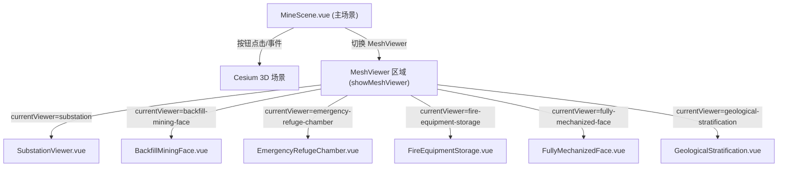
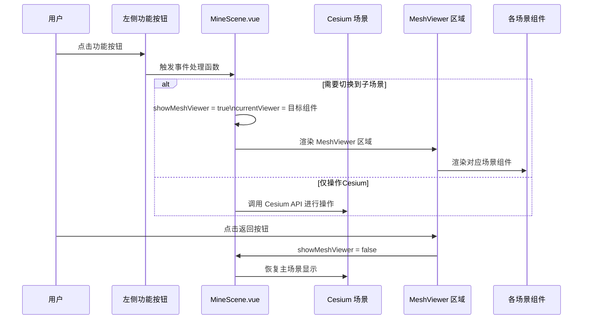
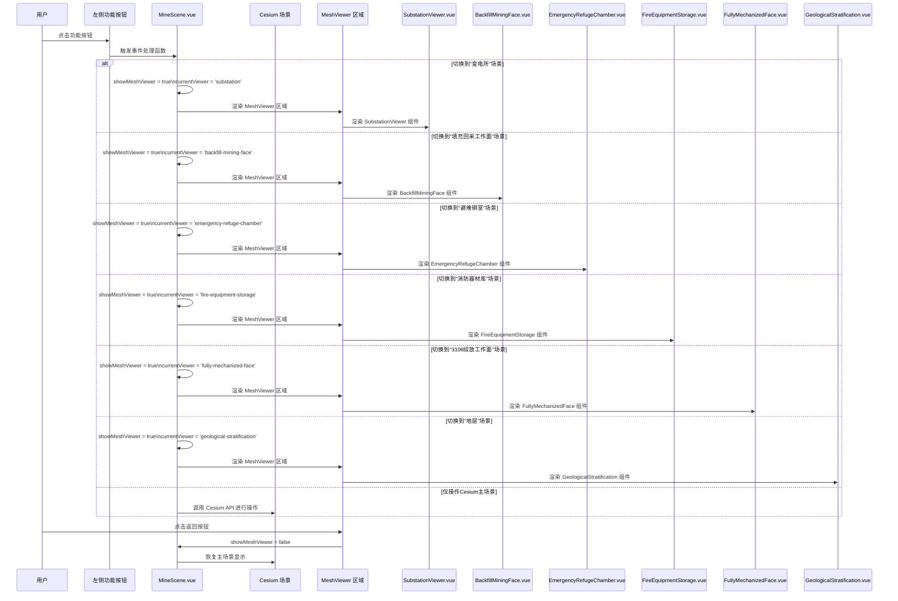
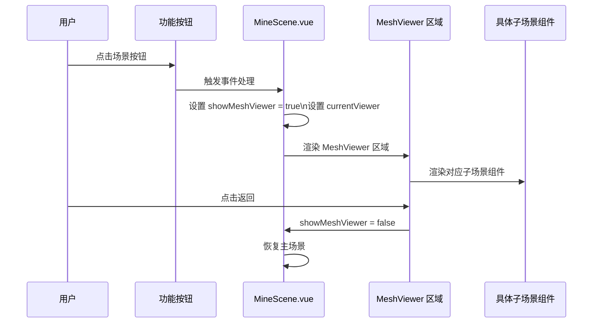
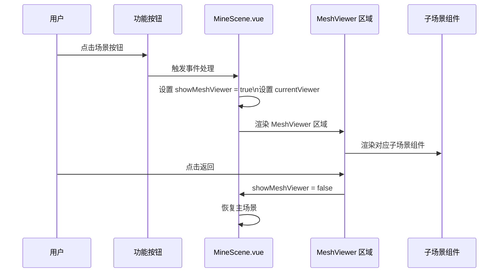

<!-- Generated by SpecStory -->

# 展示场景跳转技术栈 (2025-07-14 15:05Z)

_**User**_

该项目关于场景跳转用的技术栈陈列一下用于ppt展示，即@MineScene.vue 中图标点击事件以及@/scenes_mines 中的各场景组件

---

_**Assistant**_

根据你提供的 `@/components/MineScene.vue` 以及 `@/components/scenes_mines` 目录下的场景组件，场景跳转的技术栈和实现方式可以总结如下，适合用于PPT展示：

---

## 场景跳转技术栈与实现

### 1. 前端框架
- **Vue 3**  
  使用 Composition API（`<script setup>` 语法），实现响应式数据和生命周期管理。

### 2. 3D 场景渲染
- **CesiumJS**  
  用于三维地理空间场景的渲染和交互，支持矿井、地层等三维可视化。

### 3. 组件化开发
- **自定义 Vue 组件**  
  - 各个场景（如 `SubstationViewer.vue`, `BackfillMiningFace.vue`, `GeologicalStratification.vue` 等）均为独立的 Vue 组件，便于维护和复用。
  - 右侧信息面板采用 `right_box.vue` 组件统一样式。

### 4. 状态管理
- **Pinia**（或 Vuex，具体看 `pointStore` 实现）  
  用于管理场景切换、点位信息等全局状态。

### 5. 路由管理
- **Vue Router**  
  通过 `useRoute` 获取当前路由，实现部分场景的路由级跳转和状态控制。

### 6. 事件驱动
- **自定义事件**  
  - 通过 `window.addEventListener("switchToMeshViewer", ...)` 监听自定义事件，实现从主场景到子场景组件的切换。
  - 事件 detail 中携带目标场景信息，动态切换 `currentViewer`，渲染对应场景组件。

### 7. 响应式与交互
- **ref/reactive/watch**  
  - 使用 Vue 的响应式 API 管理按钮状态、面板显示、场景切换等。
  - 通过 `watch` 监听状态变化，驱动 Cesium 场景和组件联动。

### 8. UI 交互
- **Ant Design Vue**（如 `<a-tooltip>`）  
  - 用于按钮提示、交互体验优化。

---

## 典型场景跳转流程

1. **用户点击左侧功能按钮**  
   触发对应方法（如 `btnchange`），根据按钮类型切换场景或显示不同面板。

2. **切换到三维子场景**  
   - 通过设置 `showMeshViewer.value = true`，并根据事件或按钮选择设置 `currentViewer`。
   - `<SubstationViewer v-if="currentViewer === 'substation'" />` 等动态渲染对应场景组件。

3. **返回主 Cesium 场景**  
   - 通过按钮或事件将 `showMeshViewer.value` 设为 `false`，隐藏子场景组件，显示主场景。

---

## 相关文件结构

- `src/components/MineScene.vue`  
  主场景与跳转逻辑入口，包含按钮、事件监听、状态管理等。
- `src/components/scenes_mines/`  
  各子场景 Vue 组件，负责具体场景的三维展示与交互。

---

### 技术栈一览（PPT可用表格）

| 技术/库         | 用途                         |
|----------------|------------------------------|
| Vue 3          | 前端框架，组件化开发          |
| CesiumJS       | 3D 场景渲染                   |
| Pinia/Vuex     | 状态管理                      |
| Vue Router     | 路由管理                      |
| Ant Design Vue | UI 组件与交互                 |
| 自定义事件     | 场景切换与组件通信            |

---

如需更详细的代码流程图或交互示意，也可进一步补充！

---

_**User**_

更详细的代码流程图以及交互示意，最好可以给个mermaid代码，用于可视化这些场景组件的调用

---

_**Assistant**_

好的，下面为你梳理 `MineScene.vue` 及其与 `scenes_mines` 目录下场景组件的调用流程，并用 Mermaid 代码给出可视化的流程图和交互示意。

---

## 1. 主要交互流程说明

- 用户点击左侧按钮（如“煤层”、“定位”等）。
- 触发 MineScene.vue 中的事件处理函数（如 `btnchange`）。
- 根据按钮类型，可能会：
  - 直接操作 Cesium 场景（如定位、初始化）。
  - 切换到 MeshViewer（即 showMeshViewer = true），并设置 currentViewer。
- MeshViewer 区域根据 currentViewer 渲染对应的场景组件（如 GeologicalStratification、SubstationViewer 等）。
- 子场景组件负责各自的三维展示和业务逻辑。
- 用户可通过返回按钮切回主 Cesium 场景。

---

## 2. Mermaid 代码：场景跳转与组件调用流程

### 2.1 组件调用结构图

---

### 2.2 详细交互流程图

---

## 3. 说明

- **MineScene.vue** 作为主控，管理 Cesium 场景和 MeshViewer 区域的切换。
- **MeshViewer** 区域通过 `currentViewer` 动态渲染不同的场景组件。
- 各场景组件（如 GeologicalStratification.vue 等）只负责自身业务和三维展示。
- 所有跳转和切换均由响应式变量和事件驱动。

---

你可以将上述 Mermaid 代码直接粘贴到支持 Mermaid 的 PPT 工具或文档中进行可视化展示。如果需要更细致的组件内部调用或数据流动图，也可以进一步细化！

---

_**User**_

第二幅图要是能体现之具体的子场景组件就好了

---

_**Assistant**_

非常好的建议！下面我将第二幅时序图（sequenceDiagram）细化，明确展示每个具体的子场景组件（如 SubstationViewer、BackfillMiningFace、GeologicalStratification 等）的渲染过程。

---

## 详细交互流程图（含具体子场景组件）

---

### 使用说明

- 你可以将这段 Mermaid 代码直接粘贴到支持 Mermaid 的工具（如 Typora、Notion、Mermaid Live Editor、部分 PPT 插件等）进行可视化。
- 该图详细展示了每个按钮如何对应到具体的子场景组件，便于在 PPT 中直观展示前端场景跳转的完整流程。

如需进一步细化（比如每个子场景组件内部的交互），也可以继续补充！

---

_**User**_

精简一下，中间的内容太复杂了，重新给一下

---

_**Assistant**_

当然可以！下面是精简版的 Mermaid 时序图，突出“用户点击按钮 → MineScene 处理 → 渲染具体子场景组件”这一主流程，去掉了冗余分支，适合 PPT 展示：

---

---

### 说明

- `SceneComp` 代表如 SubstationViewer、BackfillMiningFace、GeologicalStratification 等具体子场景组件。
- 只保留了主流程，便于一眼看清场景跳转的核心逻辑。

你可以直接将这段 Mermaid 代码用于 PPT 可视化展示。

---

_**User**_

 Mermaid 代码没有给出哇

---

_**Assistant**_

非常抱歉，刚才的 Mermaid 代码被包裹在文字里没有单独列出。下面是精简版的 Mermaid 代码，可直接用于可视化：

你可以直接复制这段 Mermaid 代码到支持 Mermaid 的工具中进行可视化展示。

---

