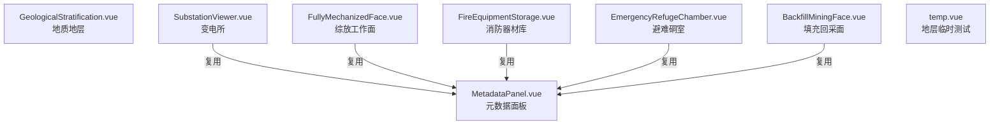
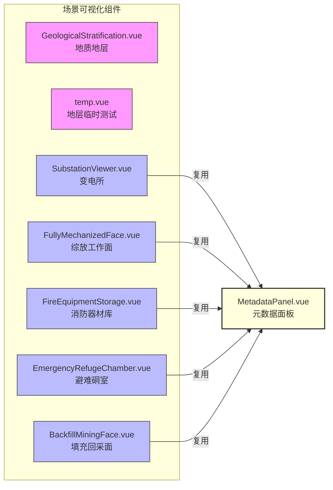

<!-- Generated by SpecStory -->

# 展示子场景模型可视化技术栈 (2025-07-14 16:03Z)

_**User**_

该项目关于子场景模型可视化技术栈陈列一下用于ppt展示，即@/scenes_mines 各组件，能提供mermaid代码展示各场景组件是如何关联的更好

---

_**Assistant**_

<details>
                <summary>Searched codebase "scenes_mines目录下各组件之间是如何关联和调用的？是否有父子组件、props、事件、依赖等？" • **25** results</summary>
            
| File | Lines |
|------|-------|
| `src/components/scenes_mines/SubstationViewer.vue` | L1-56 |
| `src/components/scenes_mines/GeologicalStratification.vue` | L1-35 |
| `src/components/scenes_mines/MetadataPanel.vue` | L237-304 |
| `src/components/scenes_mines/temp.vue` | L1-59 |
| `src/components/scenes_mines/FullyMechanizedFace.vue` | L1-56 |
| `src/components/scenes_mines/BackfillMiningFace.vue` | L1-56 |
| `src/components/scenes_mines/FireEquipmentStorage.vue` | L1-56 |
| `src/components/scenes_mines/GeologicalStratification.vue` | L252-323 |
| `src/components/scenes_mines/temp.vue` | L228-269 |
| `src/components/scenes_mines/EmergencyRefugeChamber.vue` | L1-69 |
| `src/components/scenes_mines/GeologicalStratification.vue` | L35-90 |
| `src/components/scenes_mines/SubstationViewer.vue` | L112-199 |
| `src/components/scenes_mines/BackfillMiningFace.vue` | L109-198 |
| `src/components/scenes_mines/FullyMechanizedFace.vue` | L109-198 |
| `src/components/scenes_mines/FireEquipmentStorage.vue` | L109-198 |
| `src/components/scenes_mines/SubstationViewer.vue` | L56-112 |
| `src/components/scenes_mines/EmergencyRefugeChamber.vue` | L184-262 |
| `src/components/scenes_mines/MetadataPanel.vue` | L1-26 |
| `src/components/scenes_mines/EmergencyRefugeChamber.vue` | L69-121 |
| `src/components/scenes_mines/EmergencyRefugeChamber.vue` | L121-184 |
| `src/components/scenes_mines/BackfillMiningFace.vue` | L56-109 |
| `src/components/scenes_mines/FullyMechanizedFace.vue` | L56-109 |
| `src/components/scenes_mines/MetadataPanel.vue` | L304-383 |
| `src/components/scenes_mines/GeologicalStratification.vue` | L147-193 |
| `src/components/scenes_mines/temp.vue` | L59-116 |

</details>

---

根据你提供的 `@/components/scenes_mines` 目录下的各个子场景模型可视化组件源码分析，现整理如下技术栈与组件关系，便于PPT展示：

---

### 技术栈陈列

- **前端框架**：Vue 3 + `<script setup>`
- **三维可视化引擎**：CesiumJS
- **UI/交互**：原生CSS，部分按钮/面板自定义
- **数据与元信息**：通过 `@/utils/modelInfoLoader.js` 加载模型元数据
- **组件复用**：所有场景均复用 `MetadataPanel.vue` 作为右侧元数据面板
- **模型格式**：glb/3DTiles（Cesium支持的格式）
- **事件与生命周期**：Vue的 `onMounted`、`onBeforeUnmount`，Cesium的事件监听
- **面板交互**：通过 `v-model:showMetadata` 控制元数据面板显示/隐藏

---

### 组件关系与复用（Mermaid 组件依赖图）

```mermaid
graph TD
  sub1["GeologicalStratification.vue<br/>地质地层"]
  sub2["SubstationViewer.vue<br/>变电所"]
  sub3["FullyMechanizedFace.vue<br/>综放工作面"]
  sub4["FireEquipmentStorage.vue<br/>消防器材库"]
  sub5["EmergencyRefugeChamber.vue<br/>避难硐室"]
  sub6["BackfillMiningFace.vue<br/>填充回采面"]
  sub7["temp.vue<br/>地层临时测试"]
  sub8["MetadataPanel.vue<br/>元数据面板"]
  
  sub1 -- 仅自身可视化 -- sub1
  sub2 -- "元数据面板" --> sub8
  sub3 -- "元数据面板" --> sub8
  sub4 -- "元数据面板" --> sub8
  sub5 -- "元数据面板" --> sub8
  sub6 -- "元数据面板" --> sub8
  sub7 -- 仅自身可视化 -- sub7
```

---

### 说明

- 各场景组件（如 `SubstationViewer.vue`、`FullyMechanizedFace.vue` 等）均为独立的三维场景可视化入口，负责加载各自的三维模型。
- 除 `GeologicalStratification.vue` 和 `temp.vue` 主要为地层分层交互外，其余场景均通过 `MetadataPanel.vue` 组件展示模型元数据（如精度、几何、采集方式等）。
- 组件间无父子嵌套，仅通过 `import` 方式复用 `MetadataPanel.vue`，并通过 `props` 传递元数据、标题、路径等参数。
- 所有三维场景均采用 CesiumJS 进行渲染，生命周期管理和事件监听均为 Vue + Cesium 结合实现。

---

如需更详细的技术栈分层或PPT专用的美化版Mermaid图，可进一步定制！

---

_**User**_

mermaid上传失败了，再次生成一下

---

_**Assistant**_

以下是适合PPT展示的 Mermaid 组件依赖关系图代码（可直接复制到 mermaid.live 或支持 Mermaid 的 PPT 工具中使用）：



**说明：**
- `GeologicalStratification.vue` 和 `temp.vue` 主要为地层分层交互，不依赖元数据面板。
- 其余场景组件均复用 `MetadataPanel.vue` 展示模型元数据。
- 箭头表示“复用”关系，非父子嵌套，仅为 import 依赖。

如需进一步美化或添加说明，请告知！

---

_**User**_

是要展示在ppt上的，最后布局规整一些，偏向方正

---

_**Assistant**_

明白！为了适合PPT展示，推荐用左右结构，左侧为各场景组件，右侧为统一复用的元数据面板，整体布局规整、方正。如下 Mermaid 代码可直接用于 PPT：



**使用建议：**
- 可将“场景可视化组件”作为左侧分组，右侧单独突出 `MetadataPanel.vue`。
- 颜色可根据PPT风格调整，节点名可中英文对照，便于理解。
- 只需将上述代码粘贴到 Mermaid 支持的编辑器或 PPT 插件即可自动生成规整的结构图。

如需进一步美化（如加图标、调整线条等），可继续告知！

---

