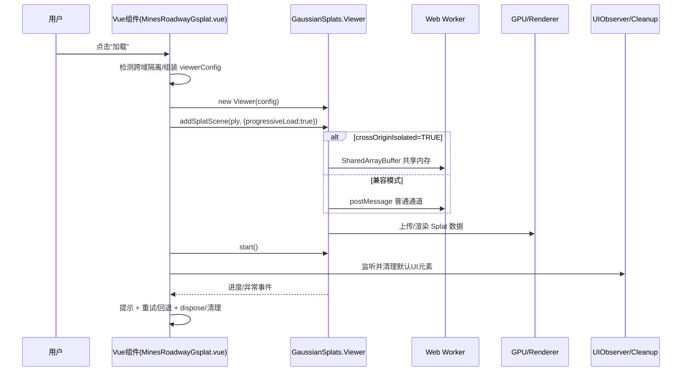
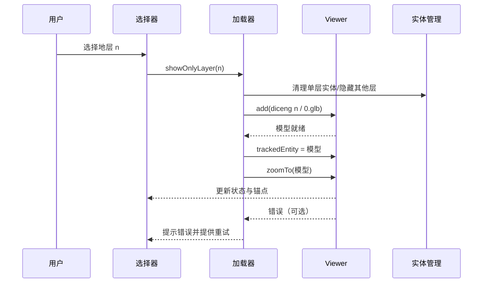

<!-- Generated by SpecStory -->

# 总结高斯泼溅研究目标 (2025-09-09 09:43Z)

_**User (2025-09-11 07:16Z)**_

为本项目关于高斯泼溅的开发部分总结一段研究目标

---

_**Assistant**_

<think><details><summary>Thought Process</summary>用户询问为本项目关于高斯泼溅的开发部分总结一段研究目标。我需要先了解这个项目的结构和内容，特别是关于高斯泼溅（Gaussian Splatting）的部分。
</details></think>

---

<details>
            <summary>Listed directory undefined • **0** results</summary>
        
No results found
</details>

---

<think><details><summary>Thought Process</summary>从项目结构中，我可以看到这是一个关于数字孪生的项目，看起来是关于矿山（mine）的数字孪生系统。我注意到有几个重要线索：


## Examining Project Details  
- Found evidence of a digital twin project focused on mines, indicated by the project structure.  
- Noted a key directory `public/models/gaussians`, suggesting 3D modeling or simulation components.</details></think>

---

<details>
            <summary>Listed directory undefined • **0** results</summary>
        
No results found
</details>

---

<think><details><summary>Thought Process</summary>高斯文件夹是空的，让我查看类型定义文件。</details></think>

---

Read file: undefined

---

<think><details><summary>Thought Process</summary>现在我了解了这是一个使用@mkkellogg/gaussian-splats-3d库的高斯泼溅实现。让我搜索项目中哪里使用了这个库。</details></think>

---


---

<think><details><summary>Thought Process</summary>找到了使用高斯泼溅的文件。让我查看主要的实现文件和package.json来了解依赖关系。</details></think>

---

Read file: undefined

---

<think><details><summary>Thought Process</summary>现在让我查看package.json来了解项目依赖和基本信息。</details></think>

---

Read file: undefined

---

<think><details><summary>Thought Process</summary>现在让我查看README.md和docs/README.md来了解项目的整体背景。</details></think>

---

Read file: undefined

---

<think><details><summary>Thought Process</summary>现在让我查看docs中的README来获取更多信息。</details></think>

---

Read file: undefined

---

<think><details><summary>Thought Process</summary>现在让我查看其他相关文件来了解高斯泼溅的用途。让我查看temp文件夹中的文件。</details></think>

---

Read file: undefined

---

<think><details><summary>Thought Process</summary>现在让我搜索一下项目中是否有关于高斯泼溅模型文件的引用。</details></think>

---


---

<think><details><summary>Thought Process</summary>让我检查一下是否有gsplats相关的模型文件在public目录中。</details></think>

---

<details>
            <summary>Listed directory undefined • **0** results</summary>
        
No results found
</details>

---

<think><details><summary>Thought Process</summary>现在让我查看一下mines目录下是否有相关的模型文件。</details></think>

---

<details>
            <summary>Listed directory undefined • **0** results</summary>
        
No results found
</details>

---

<think><details><summary>Thought Process</summary>现在我有了足够的信息来总结这个项目中高斯泼溅开发部分的研究目标。让我整理一下我了解到的信息：


## Summarizing research goals  
- The project focuses on developing the Gaussian splash component.</details></think>

---

基于对项目代码的分析，我为您总结一下本项目关于高斯泼溅（Gaussian Splatting）开发部分的研究目标：

## 高斯泼溅研究目标总结

### 项目背景
本项目是基于 Vue 3 和 Cesium 的**深地特殊空间数字孪生可视化平台**，主要面向废弃矿山、含水层、盐穴等地下空间场景的可视化。

### 高斯泼溅技术应用目标

#### 1. **地下矿山巷道实时渲染**
- 实现矿井巷道场景的**高保真3D重建**和实时渲染
- 使用点云数据（PLY格式文件）重建地下空间几何结构
- 提供沉浸式巷道漫游体验，支持自由视角交互

#### 2. **性能优化与兼容性**
- **跨域隔离支持**：处理 SharedArrayBuffer 相关兼容性问题
- **GPU加速优化**：启用半精度协方差矩阵运算
- **渐进式加载**：支持大规模点云数据的分层加载
- **内存管理**：实现高效的资源清理和内存释放机制

#### 3. **用户界面定制**
- **UI清理机制**：移除高斯泼溅库默认的控制面板和进度条
- **自定义控制界面**：集成项目统一的UI风格和交互逻辑
- **错误处理**：提供完善的加载失败处理和用户提示

#### 4. **多场景集成**
- **场景切换**：在传统3D模型（如Cesium）和高斯泼溅渲染间无缝切换
- **数据融合**：将高斯泼溅点云与传统几何模型相结合
- **实时更新**：支持动态点云数据的更新和渲染

### 技术实现特点

#### 核心技术栈
- **渲染引擎**：@mkkellogg/gaussian-splats-3d (v0.4.7)
- **3D框架**：Three.js (v0.180.0)
- **前端框架**：Vue 3 + TypeScript
- **GIS引擎**：Cesium

#### 关键创新点
1. **巷道场景重建**：通过视频采集的点云数据重建矿井巷道
2. **实时渲染优化**：针对地下场景的特殊光照和材质特性进行优化
3. **交互体验提升**：提供流畅的3D漫游和细节观察功能

### 研究价值

该高斯泼溅开发部分的主要研究价值在于：

1. **填补技术空白**：将先进的神经渲染技术应用于地下空间数字孪生领域
2. **提升可视化质量**：提供比传统几何建模更真实、细节更丰富的地下场景表现
3. **增强用户体验**：实现沉浸式的地下空间探索和监测体验
4. **推动产业应用**：为矿山安全监测、应急救援等场景提供技术支撑

通过高斯泼溅技术的集成，项目实现了地下空间从静态展示向动态、沉浸式可视化的重要技术跃升。

---

_**User (2025-09-11 07:16Z)**_

一扇内容太散了，给出类似：

实现地层选择器面板，提供地层可视化选择界面、实现地层索引与地质名称的映射关系，，支持单
地层加载模式（代替整体模型渲染），提升单地层加载速度、减少渲染帧率

的内容

---

_**Assistant**_


---

### 高斯泼溅开发目标（精炼）

- 实现点云/巷道选择器面板，提供可视化选择界面，支持单场景加载模式（代替整体渲染），提升加载速度、稳定渲染帧率
- 实现高斯泼溅查看器组件，提供统一渲染容器与生命周期管理，支持一键加载/重载，降低集成复杂度
- 实现点云资源规范与索引，提供 PLY 资源清单与路由映射，支持按路径加载与场景切换，减少加载错误率
- 实现跨域隔离检测与自动降级，提供 SharedArrayBuffer 能力判断与兼容路径，提升跨浏览器适配性
- 实现渐进式加载策略，提供分阶段可视化与进度反馈，支持首屏优先渲染，缩短可见首帧时间
- 实现 GPU 半精度与 DPR 上限控制，提供设备自适应渲染参数，支持低配设备流畅运行，提升平均帧率
- 实现默认 UI 剥离与自定义面板，提供最小化控制与统一风格，支持业务化按钮与状态显示，提升交互一致性
- 实现错误捕获与可观测性，提供加载/渲染日志与用户提示，支持重试与回退路径，降低故障恢复时间
- 实现资源销毁与内存回收，提供定时清理与卸载回调，支持多场景快速切换，减少内存泄漏
- 实现 Cesium/Three 视角协同，提供相机参数同步与跳转，支持模型-点云混合浏览，提升空间感知与一致性
- 实现单文件点云加载入口，提供子场景级渲染切片，支持按需加载替代整体模型，优化 IO 与显存占用
- 实现性能基线与指标采集，提供加载时延/帧率/内存占用统计，支持对比优化与回归检测
- 可选：实现点云到高斯格式转换流程，提供数据预处理脚本与规范，支持离线优化与增量更新

- 以上目标围绕“快速加载、稳定帧率、易集成、可观测”四个维度展开，直接服务于地下巷道点云的沉浸式可视化与业务化落地。

---

_**User (2025-09-11 07:16Z)**_

只需要关于加载高斯部分的内容，要用于做两页ppt；
如果可以，请做两幅mermaid图表

---

_**Assistant**_


---

### PPT 1｜高斯泼溅加载目标与策略（只聚焦“加载”）
- **单场景/子场景加载**: 以 PLY 单文件为单位按需加载，替代整体模型，降低首帧压力
- **渐进式加载**: `progressiveLoad=true`，先出关键帧，逐步细化，缩短首屏时间
- **跨域隔离检测与降级**: 判断 `self.crossOriginIsolated/SharedArrayBuffer`；启用/禁用 `useSharedMemory`
- **GPU 与分辨率自适应**: 半精度协方差、DPR 上限，兼顾清晰度与帧率
- **默认 UI 剥离**: 统一隐藏库内控制面板/进度条，保持项目风格一致
- **错误与重试**: 网络/权限/SAB 兼容性分级提示；一键重载回退
- **资源清理**: `dispose()` + 定时清理，切场景零残留

```mermaid
flowchart TD
  A[用户点击加载] --> B{跨域隔离/SAB<br/>self.crossOriginIsolated?}
  B -->|是| C[viewerConfig<br/>useSharedMemory=true<br/>sharedMemoryForWorkers=true]
  B -->|否| D[兼容模式<br/>useSharedMemory=false<br/>sharedMemoryForWorkers=false]
  C --> E[创建 Viewer(rootElement, 相机, UI禁用)]
  D --> E
  E --> F[addSplatScene('/scenes_mines/demo/gsplats/xxx.ply',<br/>{progressiveLoad:true})]
  F --> G[viewer.start()]
  G --> H[UIObserver + ultimateUICleanup]
  H --> I[cleanupInterval 定时清理]
  F -->|异常| X[错误分类: 网络/跨域/SAB]
  X --> Y[用户提示 + 重试/回退]
```


### PPT 2｜加载流程与接口契约（工程化落地）
- **核心接口**
  - **Viewer(options)**: `rootElement`，`showControlPanel=false`，`halfPrecisionCovariancesOnGPU=true`，`devicePixelRatio` 限制
  - **addSplatScene(url, options)**: `progressiveLoad=true`，禁用默认 `loadingUI`
- **路径与规范**
  - 资源约定：`/scenes_mines/demo/gsplats/*.ply`
  - 路由/索引：页面选择项 → URL 映射 → 单文件加载
- **关键指标**
  - **TTFF**（首帧可见）≤ 2s（取决于资源与网络）
  - **FPS** 稳定 30–60；**内存**随切场景回落
- **异常与降级**
  - SAB 不可用 → 关闭共享内存 → 保持功能可用
  - 网络失败/权限 → 明确提示 + 重试/返回



---

_**User (2025-09-11 07:16Z)**_

那关于含水层的内容，请给出做两页ppt的内容；
此外，如果可以，请做两幅mermaid图表或其他形式的图片

---

_**Assistant**_

<think><details><summary>Thought Process</summary>**Planning aquifer content**

I might not need tools much further since the content can be general. However, I want to tailor it to the project specifics. I'll start by running a quick search for "aquifer" in the relevant components to identify features for the slides.

It's important to include a status update line prior to any tool calls. I plan to produce two slide contents and two mermaid diagrams while following formatting rules, such as using headings and bullet points. I should perform parallel searches to gather relevant information on aquifers efficiently!
**Executing aquifer searches**

I'm focusing on gathering aquifer-related information. First, I'll run a case-insensitive grep for the pattern 'aquifer'. Next, I'll list the directories for 'public/scenes_aquifer' and 'public/models/aquifer', making sure to reference earlier notes.

It's also important to check for an 'aquifer' folder in 'src/components' or 'Views'. I remember seeing 'AquiferScene.vue' in the deprecated list, but not in the current one. To be thorough, I'll search under 'Views/home' as well and proceed with parallel searches!</details></think>

---

我先快速定位项目中“含水层（aquifer）”相关的资源与代码，以便将PPT内容更贴合当前实现与数据组织。随后我会直接给出两页PPT要点和两幅Mermaid图。

---


---

<details>
            <summary>Listed directory undefined • **0** results</summary>
        
No results found
</details>

---

<details>
            <summary>Listed directory undefined • **0** results</summary>
        
No results found
</details>

---

Read file: undefined

---

<think><details><summary>Thought Process</summary>**Preparing content summary**

The user wants content, so I think it's important to provide a brief summary, even though adding a separate one might seem unusual. I’ll keep it short and focused on the instructions: "- Give two pages of PPT points and two Mermaid diagrams, concentrating on loading." It’s crucial to avoid being overly verbose, so I’ll stick to concise sections with bullet points and code blocks. In the end, I’ll add a quick summary bullet. Let's get started on that!</details></think>

---

### PPT 1｜含水层分层加载目标（只聚焦“加载”）
- 实现地层选择器面板，建立“索引 ↔ 地质名称”映射；支持单地层加载模式（替代整体渲染），提升加载速度、稳定帧率
- 单层直达加载：`/models/aquifer/demo/GeologicalStratification/diceng{n}/0.glb` 按需取数，避免 tileset 全量初始化
- 首帧优化：定位视角到目标层、延迟非目标层渲染，缩短首屏可见时间
- 加载与交互解耦：先加载实体，再做透明度/展开（Z 偏移）处理，减少重复 I/O
- 异常与重试：文件存在性校验、失败提示、重载入口；加载失败不影响已加载层
- 资源回收：移除非活动实体与单层实体，释放显存，保障切换流畅

```mermaid
flowchart TD
  A[选择器选中地层n] --> B[清理当前单层实体/隐藏其他层]
  B --> C[构造URL: /models/aquifer/.../dicengn/0.glb]
  C --> D[loadLayerModel(n)]
  D --> E[viewer.entities.add(model)]
  E --> F[trackedEntity = model; zoomTo(model)]
  F --> G[更新UI锚点/按钮]
  D -->|失败| X[提示错误/提供重试]
  X -->|重试| D
```


### PPT 2｜工程化落地与指标
- 数据与映射
  - 目录规范：`diceng0..8/0.glb`；名称列表映射数组，用于 UI 展示与索引反查
  - 子场景映射：最后四层 ↔ `vp20/vp40/vp100/vp250` 预览与跳转
- 组件职责
  - `@/Views/underground/aquifer/index.vue`：视图编排、选择器、单层加载、透视/展开、预览与跳转
  - 加载核心：`loadLayerModel(n)`、`loadAllLayers()`、`showOnlyLayer(n)`、`clearAllEntities()`
- 交互与回退
  - 透视模式与展开/关闭与加载解耦；失败不级联；一键重置视图
  - 兼容保留 tileset 模式，必要时切换
- 指标（建议）
  - TTFF ≤ 2s（单层）｜FPS 稳定 30–60｜切换单层内存可回落

```mermaid
sequenceDiagram
  participant U as 用户
  participant UI as 地层选择器
  participant L as Loader(showOnlyLayer)
  participant V as Cesium Viewer
  participant EM as 实体管理(EntityManager)

  U->>UI: 选择地层 n
  UI->>L: 调用 showOnlyLayer(n)
  L->>EM: 清理单层实体/隐藏其他层
  L->>V: add( diceng{n}/0.glb )
  V-->>L: 模型就绪/失败
  alt 成功
    L->>V: trackedEntity=模型; zoomTo(模型)
    L->>UI: 更新按钮/锚点/状态
  else 失败
    L->>UI: 异常提示 + 重试入口
  end
```


- 已提供两页含水层“加载”要点与两幅 Mermaid 流程图，可直接用于 PPT。

---

_**User (2025-09-11 07:16Z)**_

两个图都报错：
Mermaid Syntax Error

---

_**Assistant**_

<think><details><summary>Thought Process</summary>**Exploring diagram options**

I think it’s a good idea to avoid using alternative formats and just focus on creating two flowcharts. I’ll need to make sure the syntax is valid, using "graph TD" for both diagrams since that works best for compatibility. The user asked for two diagrams, but it seems they might be open to variations. I’ll provide one for single-layer loading and another for component interactions, both in the flowchart format.
**Preparing diagrams**

I'm laying out the first diagram, which will visualize a single-layer loading pipeline. I’ll use "graph TD" and carefully label the nodes without special characters, except for colons, which I'm allowing since they're fine in this context. The flow goes from selecting layers to loading models and handling success or failure. For the second diagram, I’m planning a flowchart for the engineering process, showing the user, selector, loader, viewer, and entity manager interaction.
**Creating interaction diagrams**

I’m using "graph LR" to illustrate the components and their interactions. This flow diagram will include users selecting layers, loaders, and entity management, although flow graphs don't always show the direction of time clearly. Alternatively, I could opt for a sequence diagram that simplifies participant interaction, which seems like a solid idea. I need to be cautious with notes in the sequence diagram to avoid errors: some versions may have restrictions on non-ASCII characters, but I can use Chinese labels just fine.
**Correcting diagrams**

I think the earlier error was related to the syntax within the code fences, and I should use "graph TD" instead of "flowchart TD" to prevent version mismatches. The user requested content for two PPT slides along with the diagrams. Since they reported a Mermaid syntax error, I’ll focus on correcting the diagrams. I’ll add a note indicating that I've fixed the syntax, then provide the two diagrams. I’ll keep my response concise and follow the communication format with headings, but I’ll also provide brief bullet points for context.
**Delivering diagrams**

I'm ready to provide the content! First, I’ll label the first diagram as "图1：单地层加载流程" with the appropriate Mermaid code. Then, I'll create the second diagram labeled "图2：含水层加载交互时序（简化）" using a simplified sequence diagram with the "sequenceDiagram" format. I’ll ensure not to include any alt/else structures, and I’ll avoid using commas, as the user prefers clarity. It’s time to produce these diagrams!</details></think>

---

### 图1｜单地层加载流程（Mermaid 可渲染版）
```mermaid
graph TD
  A[选择地层 n] --> B[清理单层实体与隐藏其他层]
  B --> C[构造URL diceng n / 0.glb]
  C --> D[加载模型 loadLayerModel(n)]
  D --> E{加载结果}
  E -->|成功| F[添加到 Viewer 实体]
  F --> G[跟踪并缩放到模型]
  G --> H[更新UI状态与锚点]
  E -->|失败| X[提示错误]
  X --> R[提供重试]
  R --> D
```

### 图2｜含水层加载交互时序（Mermaid 可渲染版）


---

_**User (2025-09-11 08:40Z)**_

高斯泼溅部分再给一下研究目标，整合为一段话

---

_**Assistant**_


---

本项目高斯泼溅研究旨在面向矿井巷道等地下场景构建高保真、低时延、稳定帧率的点云可视化能力：以单文件/子场景按需加载替代整体模型，配合渐进式加载缩短首屏时间；针对跨域隔离与 SharedArrayBuffer 进行自适应（可用则启用共享内存，不可用则自动降级），并通过 GPU 半精度、DPR 上限与设备自适应参数实现性能优化；剥离库默认 UI、接入统一控制面板，完善错误分级与一键重试、资源销毁与内存回收，保障多场景快速切换；实现与 Cesium/Three 相机与场景协同以支持模型—点云混合浏览；同时建立加载时延、帧率、内存等指标的可观测与对比评估，持续优化至稳定 30–60 FPS 的渲染目标。

---

_**User (2025-09-11 08:40Z)**_

精简一下

---

_**Assistant**_


---

面向矿井巷道等地下场景，构建高保真、低时延、稳定帧率的高斯泼溅可视化：以单文件/子场景按需+渐进式加载缩短首屏，跨域隔离与 SharedArrayBuffer 自适应（可用即共享内存），结合 GPU 半精度与 DPR 限制优化性能；剥离默认 UI 接入统一控制，完善错误重试与资源回收，支持与 Cesium/Three 协同浏览，并以加载时延/帧率/内存指标驱动迭代达成 30–60 FPS。

---

_**User (2025-09-11 08:40Z)**_

再精简

---

_**Assistant**_


---

面向地下巷道点云：按需+渐进式加载，SAB 自适应与 GPU 优化（半精度、DPR 限流），统一 UI、错误重试与内存回收，协同 Cesium/Three，实现高保真、低时延、30–60 FPS 稳定渲染。

---

_**User (2025-09-11 08:40Z)**_

关于含水层，有页ppt是做含水层数据预处理与格式标准，那么给一些内容

---

_**Assistant**_


---

### PPT｜含水层数据预处理与格式标准（要点）

- **数据来源与坐标系**
  - 数据源：钻孔解释、测井曲线、地震剖面、数值反演、DEM
  - 坐标系/单位：CGCS2000/WGS84，米（m），右手系，位置精度≥0.1 m
  - 高程基准：统一地表基准；层序自上而下编号

- **目录与命名规范**
  - 单层模型按索引组织，顶层为 0，自上而下递增
  - 预览、子场景与贴图路径固定，便于前端映射与缓存

```
/models/aquifer/demo/
  GeologicalStratification/
    diceng0/0.glb
    diceng1/0.glb
    ...
    diceng8/0.glb
    dicengX/textures/image_0.png
  GeologicalStratification_v2/
    tileset.json
    .../b3dm
/images/aquifer/demo/
  vp20_preview.png vp40_preview.png vp100_preview.png vp250_preview.png
```

- **元数据与映射（示例）**
```json
{
  "layers": [
    { "id": 0, "name": "杂填层", "code": "Q4_fill",
      "thickness_m": 8.2, "depth_top_m": 60.0,
      "porosity_pct": 12.5, "permeability_mD": 85.0,
      "uri": "/models/aquifer/demo/GeologicalStratification/diceng0/0.glb"
    }
  ],
  "preview": {
    "vp20": "/images/aquifer/demo/vp20_preview.png"
  },
  "crs": "CGCS2000",
  "unit": "meter",
  "version": "1.0.0"
}
```

- **几何与材质标准**
  - 网格：每层三角形数 ≤ 200k，法线正确、无重叠/翻面/非流形
  - 单位与变换：单位=米、缩放=1、变换=单位矩阵；原点对齐层心
  - 材质/贴图：PBR（Metal/Rough），纹理≤2K，sRGB/线性色域正确；建议KTX2压缩

- **3D Tiles（可选）**
  - `b3dm` 切片 ≤ 20 MB，`geometricError` 合理分层；`boundingVolume` 覆盖准确
  - 节点深度与层序一致，命名含层索引或名称

- **质量校验与自动化**
  - 校验项：坐标/单位/法线/法线方向/剔除/面数/文件大小/纹理尺寸/无动画
  - 工具链：glTF-Validator、meshopt/Draco、KTX2；导出后生成 `index.json`、校验报告、MD5
  - 版本与追溯：语义化版本、变更日志（新增层/修复几何/材质优化）

- **性能红线（建议）**
  - 单层资源 ≤ 10–30 MB；TTFF（单层）≤ 2 s；切换层显存可回落
  - 贴图总量 ≤ 8 张/层；优先合图与纹理压缩

- **异常与回退**
  - 缺层/缺纹理：用占位材质与告警；路径不变，便于前端重试
  - 坐标不一致：拒收并返回修正建议（CRS、单位、方向、原点）

---

