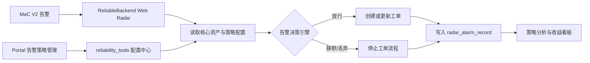

# 实习产出总结（二）：TikTok Web 差异化告警策略与配置平台建设

## 一、项目概述

### 1. 背景

TikTok Web 日常值班会同时接收核心服务和非核心服务的告警。对 2026 年 1 月 1 日至 5 月 11 日的 Avocado 告警数据进行分析后发现：在 542 条有效告警中，非核心项目告警为 69 条，占 12.73%；但非核心项目对应的线上问题只有 7 条，仅占全部线上问题的 6.86%。

这说明非核心项目产生了相对较多的低影响告警，会持续占用值班人员的注意力，使真正影响核心资产的告警无法获得最优先的响应。

与此同时，域名可用性、网关下游可用性等告警采用“一条规则覆盖多个服务”的方式下发。若直接在 MaC 规则侧调整阈值，会同时影响所有服务，无法处理活动流量、异常攻击或特殊路径等个性化场景。因此，需要在告警进入工单系统前增加一层可配置的精细决策能力。

### 2. 项目目标

我围绕以下目标完成了方案设计和前后端能力建设：

- 根据资产等级区分核心与非核心项目，采用不同的告警放行策略；
- 非核心项目仅保留持续时间较长、影响程度较重的异常，降低低价值噪音；
- 支持按服务、路径和下游服务配置个性化阈值，不影响共用同一 MaC 规则的其他项目；
- 将策略配置、执行结果和历史操作结构化沉淀，为报警准确率、MTTA 和噪音变化提供数据基础；
- 在策略配置服务异常时保持 fail-open，避免告警治理系统自身故障导致关键告警被误吞。

## 二、我的主要工作

### 1. 设计差异化告警决策模型

我将原本单一的“报警触发即创建工单”流程改造为分层决策模型，并明确以下优先级：

1. **黑名单策略**：命中项目黑名单的非 SLO 告警直接丢弃；`product_slo` 告警不受黑名单影响，避免核心 SLO 信号被误拦截。
2. **个性化覆盖策略**：优先匹配项目、路径或下游服务的特殊阈值；多条规则同时命中时，匹配字段越具体的规则优先，同等具体度下按配置顺序确定结果。
3. **核心项目默认策略**：核心项目告警直接放行，保证核心资产问题及时触达。
4. **非核心项目默认策略**：仅 `is_long_critical=true` 的长时间严重异常放行，短时波动进行静默。
5. **异常兜底策略**：当核心资产接口或 MaC 严重度信号缺失时采用 fail-open，继续放行，避免因判断依据不完整造成漏报。

策略结果使用明确的决策标识记录，包括 `blacklist_dropped`、`core_emit`、`noncore_long_critical_emit`、`noncore_suppressed`、`override_emit` 和 `override_suppressed` 等，使每次放行或静默都可以追溯原因。

### 2. 建设 Portal 告警策略管理前端

我在 Portal 的 Alarm Management 模块中建设了统一的“告警策略管理”界面，将配置能力从手工修改配置文件升级为可视化、可审计的产品能力。

前端包含两个二级页面：

- **告警黑名单**：支持按 PSM 查询、加入黑名单、移出黑名单以及查看历史操作记录；
- **告警阈值覆盖**：支持配置域名路径可用性和网关下游告警的个性化策略，并提供新增、编辑、删除、筛选、刷新和历史审计能力。

个性化覆盖当前支持三类 MaC 组件：

| 告警类型 | MaC 组件 | 可配置维度 | 阈值类型 |
| --- | --- | --- | --- |
| `domain_availability_by_path` | `V2MonitorDomainSLIAvailability` | `service`、可选 `route` | 短/长窗口成功率 |
| `gateway_downstream` | `V2MonitorGatewayDownstreamAvailability` | `_to_service` | 短/长窗口成功率 |
| `gateway_downstream` | `V2MonitorGatewayTrafficDrop` | `_to_service` | 短/长窗口流量跌幅 |

表单会根据告警类型和 MaC 组件动态切换字段，并在前端完成参数校验：成功率阈值限制在 0～1，流量跌幅限制在 -100～0；所有变更必须填写原因，历史抽屉会保留操作类型、策略快照、操作人和操作时间，满足后续审计需要。

### 3. 落地 ReliableBackend 告警决策主链路

我在 ReliableBackend 中增加了独立的 `emitDecision` 模块，并将其接入 Web Radar 创建工单之前的主链路：

后端采用“服务编排层 + 纯逻辑层”的结构：

- `service/web-radar/emitDecision/main.ts` 只负责读取黑名单、核心资产和个性化配置，并编排数据持久化；
- `logic/web-radar/emitDecision/decision.ts` 负责核心/非核心决策树；
- `personalizedOverride.ts` 负责匹配 service、route、`_to_service`，识别成功率/流量下跌类型并计算阈值；
- `macSeverity.ts` 负责从 MaC V1/V2 数据中提取长短周期严重度信号；
- `normalize.ts` 负责对上游聚合配置进行清洗和结构归一。

该拆分使策略算法不依赖网络和数据库 IO，可独立理解和验证，也避免告警主入口不断堆积业务判断。

### 4. 建设高可用配置读取机制

告警策略位于告警主链路上，因此配置读取不能成为新的单点风险。我为配置客户端增加了多级保护：

- 通过 Service Mesh/Consul 调用 `reliability_tools` 聚合接口，并使用 JWT 完成服务鉴权；
- 使用 60 秒进程级 L1 缓存吸收单实例内的 webhook 突发流量；
- 使用 5 分钟 Redis L2 缓存共享配置，降低多实例重复请求；
- 使用 singleflight 合并并发刷新，避免缓存失效瞬间产生请求风暴；
- Redis 操作设置 300ms 超时，不允许缓存系统阻塞告警主链路；
- 上游拉取失败时优先复用旧配置，否则回退到空配置并 fail-open；
- 使用 10 秒 negative cache 避免上游故障期间每条 webhook 都等待完整超时。

这套设计兼顾了配置生效速度、运行时性能和故障安全性。

### 5. 建立策略执行数据回收能力

为了验证降噪是否造成漏报，我没有只记录最终创建工单的告警，而是让被静默和被丢弃的事件同样写入 `radar_alarm_record`。

当前数据模型会沉淀：

- `project_level`：核心、非核心或未知；
- `suppressed`：是否被策略静默；
- `decision_extra`：包含具体决策、命中的覆盖策略和严重度信号；
- `created_ticket`：标记该次事件是否真正创建了新工单。

通过这些字段，可以区分“全部告警事件”和“真实创建工单”，统计不同策略的命中量、静默量和准确率，并反查任意告警为什么被放行或被抑制，为后续收益看板提供可信数据源。

在此基础上，我进一步建设了 Portal“告警策略分析”页面，支持按时间、执行结果、命中策略、项目等级、告警类型、项目和 Region 筛选，并提供执行概览、策略分布、项目等级分布和逐条决策记录。看板同时区分“全部报警事件”和“真实创建工单”，使策略收益能够直接从线上数据验证，而不再依赖人工抽样。

## 三、前后端技术栈

| 层次 | 技术栈 | 主要用途 |
| --- | --- | --- |
| 前端框架 | React 18.2 + TypeScript 5.0 | 告警策略管理页面与类型安全 |
| UI 组件 | Arco Design 2.63 + SCSS Modules | 表格、表单、弹窗、抽屉和页面样式 |
| 数据请求 | TanStack React Query 5.83 | 配置查询、Mutation、缓存失效与刷新 |
| 路由与平台能力 | TTAstra Router + BAM 生成客户端 | 二级 Tab 路由和类型化服务调用 |
| 辅助能力 | Day.js、国际化 `t()` | 时间格式化和多语言文案 |
| 后端语言与框架 | Node.js + TypeScript 4.9 + GuluX 1.7 | Web Radar 服务、依赖注入和业务编排 |
| 配置通信 | GuluX HTTPClient + Service Mesh/Consul + JWT | 获取统一告警策略配置 |
| 缓存 | 进程内缓存 + Redis | 降低配置查询延迟和上游压力 |
| 数据持久化 | Sequelize 6 + `radar_alarm_record` | 保存告警与策略执行记录 |
| 工程验证 | TypeScript、Jest、Rush/RushX | 类型检查、单元测试和前端构建 |

## 四、最终进展

### 1. 已完成能力

| 能力 | 当前进展 |
| --- | --- |
| 核心/非核心资产识别 | 已接入 SLI 推导的核心资产数据，支持 `core / non_core / unknown` 三态 |
| 告警黑名单管理 | 已提供 Portal 查询、增删和历史审计界面 |
| 个性化阈值管理 | 已支持域名路径和网关下游两类告警、三类 MaC 组件 |
| 后端决策链路 | 已接入工单创建前主链路，支持黑名单、覆盖策略和核心/非核心默认策略 |
| 配置高可用 | 已实现 L1/L2 缓存、singleflight、超时、旧配置回退和 fail-open |
| 静默事件留痕 | 已将被静默/丢弃事件写入告警记录，支持决策反查 |
| 真实出单识别 | 已增加 `created_ticket` 标记，可区分全部事件与真实工单 |
| 策略收益看板 | 已提供多维筛选、执行概览、策略/项目等级分布和逐条记录查询 |

### 2. 量化收益基线

上线前数据基线如下：

| 指标 | 总数 | 核心项目 | 非核心项目 | 非核心占比 |
| --- | ---: | ---: | ---: | ---: |
| 有效告警 | 542 | 473 | 69 | 12.73% |
| 误报告警 | 32 | 31 | 1 | 3.12% |
| 对应线上问题 | 102 | 95 | 7 | 6.86% |

非核心项目告警占比 12.73%，但其线上问题占比只有 6.86%，两者相差 5.87 个百分点，说明差异化降噪具有明确的优化空间。

### 3. 上线后实测收益

我通过线上“告警策略分析”页面，对策略上线后的数据进行了分段查询。由于页面单次最多支持 7 天，统计采用连续且不重叠的时间窗；统计范围为 **2026-06-25 00:00 至 2026-07-16 14:15（UTC+8）**，记录范围选择“全部报警事件”。

| 时间窗（UTC+8） | 报警事件 | 策略静默 | 项目黑名单 | 非核心短时静默 | 覆盖阈值静默 | 非核心事件 | 非核心静默 |
| --- | ---: | ---: | ---: | ---: | ---: | ---: | ---: |
| 06-25 00:00 ～ 07-01 23:59 | 720 | 220 | 176 | 35 | 9 | 520 | 211 |
| 07-02 00:00 ～ 07-08 23:59 | 675 | 289 | 192 | 71 | 26 | 450 | 263 |
| 07-09 00:00 ～ 07-15 23:59 | 742 | 116 | 82 | 34 | 0 | 324 | 116 |
| 07-16 00:00 ～ 07-16 14:15 | 82 | 20 | 13 | 4 | 3 | 32 | 17 |
| **合计** | **2,219** | **645** | **463** | **144** | **38** | **1,326** | **607** |

实测结果表明：

- 共处理 2,219 条报警事件，其中 645 条被策略静默，整体静默率为 **29.1%**；
- 项目黑名单静默 463 条，占全部静默事件的 **71.8%**；
- 非核心短时告警静默 144 条，占全部静默事件的 **22.3%**；
- 个性化阈值重写命中后静默 38 条，占全部静默事件的 **5.9%**；
- 1,326 条非核心项目报警中有 607 条被静默，非核心告警静默率达到 **45.8%**，高于 30% 的收益目标 **15.8 个百分点**；
- 同期产生 129 条新工单；被静默事件均保留完整决策记录，但不会继续进入出单流程，实现了“降噪不丢审计数据”。

> **核心资产工单关单率目标：100%**  
> **非核心告警噪音下降目标：≥ 30%**  
> **上线后实测：非核心告警静默率 45.8%（607 / 1,326），超过目标 15.8 个百分点。**

数据一致性校验：项目黑名单 463 条、非核心短时静默 144 条、覆盖阈值静默 38 条，三类策略合计 645 条，与执行概览中的“策略静默”总量完全一致。需要说明的是，45.8% 是上线后事件流中的实际静默比例，可直接反映策略拦截效果；若要严格计算“上线前后同周期告警量下降率”，仍需补充上线前同口径 21 天或 30 天对照数据。当前页面未提供工单关单状态，因此“核心资产工单关单率 100%”仍作为验收目标，不在此处冒充实测结论。

## 五、项目价值

### 1. 值班效率提升

通过过滤非核心服务的短时抖动，减少低影响告警对值班人员的打断，把响应资源优先分配给 P0/P1 核心资产，改善核心问题的发现和响应效率。

### 2. 告警准确性提升

将原本“一条规则覆盖所有服务”的粗粒度机制升级为 service、route、`_to_service` 级别的精准控制。特殊流量、易受攻击服务和个别路径可以独立调整阈值，不再影响同一模板下的其他业务。

### 3. 策略管理产品化

将黑名单和阈值覆盖从手工配置转化为 Portal 可视化管理，提供参数校验、操作原因和历史审计，降低配置门槛和误操作风险，也便于后续扩展新的告警类型。

### 4. 决策过程可观测

放行、静默和丢弃事件均有记录，每次决策都可以追溯到资产等级、命中策略和阈值信号。团队可以进一步统计策略命中率、报警准确率和 MTTA，并识别长期无命中的僵尸规则。

### 5. 主链路可靠性保障

通过多级缓存、超时隔离、旧配置回退和 fail-open，确保策略系统异常不会阻断告警主流程，避免“为了降噪而漏掉关键告警”的次生风险。

## 六、后续度量建议

- 按上线前后各 30 天对比非核心项目告警量和占比，验收“噪音下降 ≥30%”；
- 按核心/非核心拆分 MTTA，重点观察核心项目平均响应时间是否下降；
- 基于 `is_correct` 统计各策略分支的报警准确率；
- 统计每条个性化覆盖规则的命中量、准确率和最后命中时间，治理无效配置；
- 后续接入 GOC 数据，将被静默事件与同项目 ±30 分钟内的线上升级记录关联，自动验证是否存在漏报。

## 七、总结

在这项工作中，我完成了从数据分析、方案设计到前后端落地的完整闭环：以核心资产等级为基础建立差异化决策模型，在 Portal 提供可视化策略配置和历史审计，在 ReliableBackend 告警主链路中实现精细阈值匹配、核心/非核心分流和静默事件留痕，并通过多级缓存与 fail-open 保障运行可靠性。

该产出把 TikTok Web 告警治理从“规则触发即出单”的统一模式，升级为“资产分级 + 个性化配置 + 可观测决策”的平台化能力。上线后累计处理 2,219 条报警事件，静默 645 条；其中 607 条非核心告警被静默，非核心静默率达到 45.8%，验证了差异化策略对值班降噪的实际价值。

## 八、参考资料

- [总体方案设计](https://bytedance.larkoffice.com/wiki/KiEuwru7WiZSsakxEvTcC8TIn3e)
- 前端代码：`/Users/bytedance/work/tt_arch/arch_web_monorepo/subspaces/portal/platform/src/modules/Admin/AlarmManagement/AlarmStrategyPanel`
- 后端代码：`/Users/bytedance/work/ReliableBackend/ReliableBackend/app/service/web-radar/emitDecision/main.ts`
- 数据基线：《TikTok Web 报警分析报告（2026-01-01 ～ 2026-05-11）》
