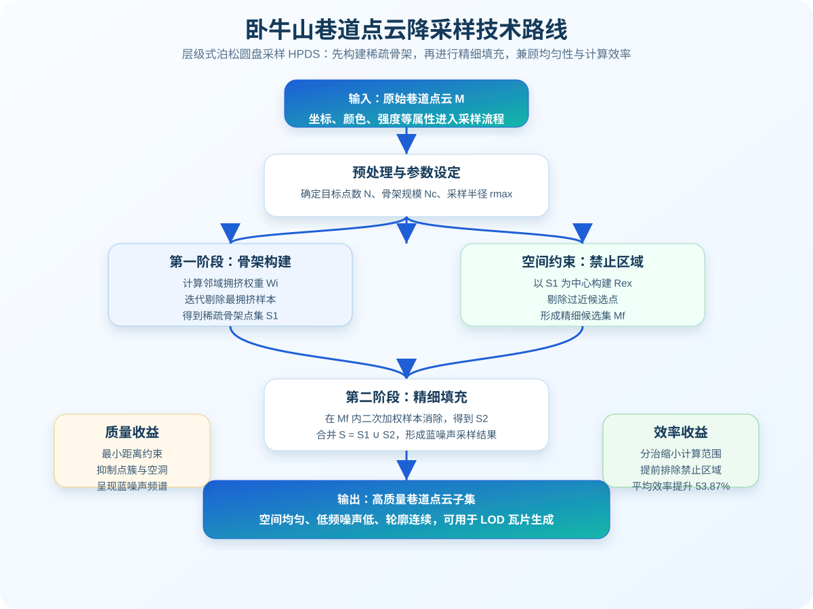
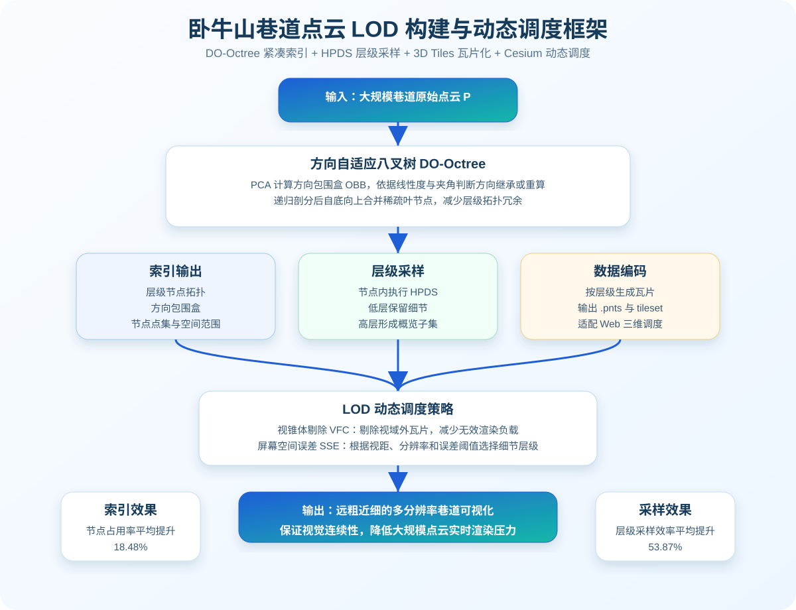
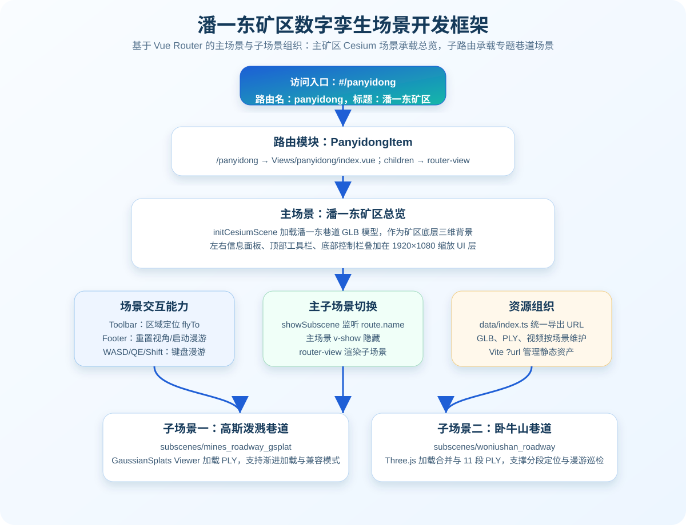
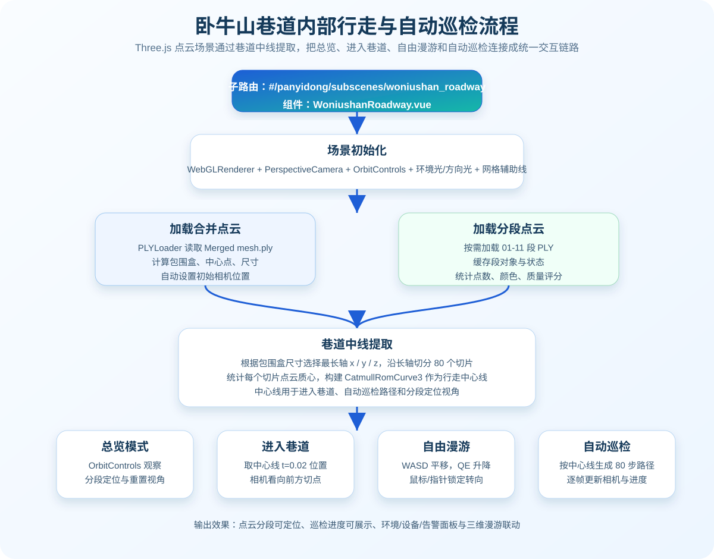
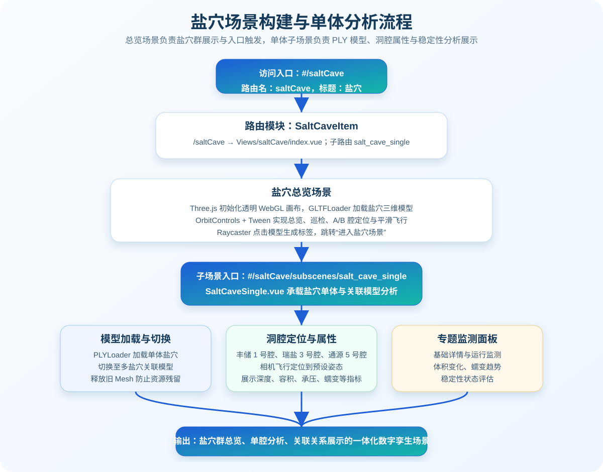

# PPT 大纲

## 卧牛山巷道点云降采样

### 建议页 1：研究背景与问题

- 卧牛山巷道点云数据规模大、空间狭长且局部密度不均，直接渲染会带来加载慢、帧率低和交互卡顿问题。
- 传统随机采样容易出现点簇与空洞，网格采样虽然规则但易产生周期性走样，难以兼顾视觉质量与实时效率。
- 降采样目标不是简单减少点数，而是在保留巷道几何轮廓的同时获得均匀、低噪声、适合 LOD 的代表性点集。

### 建议页 2：层级式泊松圆盘采样 HPDS

### PPT 要点

- 方法采用“骨架构建 + 精细填充”的分治思路：先通过加权样本消除得到稀疏骨架点集 S1，再以骨架点为中心构建禁止区域，缩小后续计算范围。
- 在剩余候选集 Mf 中再次执行加权样本消除，提取填充点集 S2，最终合并为 S = S1 ∪ S2。
- 泊松圆盘约束保证任意两点之间具有最小距离，可减少局部点簇、空洞和渲染颗粒感。
- 采样结果具有蓝噪声特性：低频能量被抑制，高频能量分布均匀，适合作为点云 LOD 层级数据。
- 论文实验显示，HPDS 在保证采样质量的前提下，相较基准算法计算效率平均提升 53.87%。

## 卧牛山巷道点云 LOD 构建

### 建议页 1：LOD 构建总体框架

### 建议页 2：DO-Octree 空间索引

- 针对巷道点云的各向异性分布，采用方向自适应八叉树 DO-Octree 替代刚性轴对齐八叉树。
- 根节点通过 PCA 计算方向包围盒 OBB，使包围空间沿点云主方向贴合，减少空白空间。
- 子节点先进行主方向稳定性判断：若线性度不足，继承父节点方向，避免噪声导致包围盒抖动；若方向稳定，再根据父子主方向夹角决定继承或重新计算 OBB。
- 递归划分后执行自底向上的单元格合并，将稀疏区域中过度细分的叶节点合并，降低层级拓扑冗余。

### 建议页 3：LOD 数据生成与动态调度

- 自上而下使用 DO-Octree 完成分层分块，自下而上对每个节点执行 HPDS，形成由粗到细的多分辨率点云层级。
- 层级数据可编码为符合 3D Tiles 规范的 `.pnts` 瓦片，供 Web 三维引擎按需加载。
- 运行时采用视锥体剔除 VFC 先排除不可见瓦片，再根据屏幕空间误差 SSE 选择需要细化的层级。
- 调度效果呈现“远处加载粗层级、近处加载细层级”，在保证视觉连续性的同时降低渲染负载。

### PPT 要点

- DO-Octree 解决“索引松散”的问题，HPDS 解决“层级采样质量与效率”的问题，VFC + SSE 解决“运行时按需加载”的问题。
- 论文实验显示，DO-Octree 相比传统八叉树平均节点占用率提升 18.48%，对地下车站、隧道和矿山巷道等狭长稀疏点云尤其有效。
- 该部分可作为从算法研究过渡到项目应用的技术承接：前端数字孪生场景中加载与交互的点云模型，可由该 LOD 构建链路支撑。

## 卧牛山巷道数字孪生场景开发

### 建议页 1：项目路由与场景组织

### 建议页 2：潘一东主场景开发逻辑

- 路由模块 `src/router/modules/panyidong.ts` 将 `/panyidong` 注册为潘一东矿区主入口，组件指向 `src/Views/panyidong/index.vue`。
- 主场景使用 Cesium 初始化潘一东巷道 GLB 模型，并叠加左右统计面板、工具栏、底部控制栏和漫游按键提示。
- UI 层以 1920×1080 为设计基准，通过窗口尺寸计算 `scale(width / 1920, height / 1080)`，适配不同分辨率大屏。
- `showSubscene = route.name !== 'panyidong'` 用于判断是否进入子场景：主场景隐藏后由 `<router-view />` 渲染巷道专题场景。

### 建议页 3：子场景能力划分

- 高斯泼溅巷道子路由 `subscenes/mines_roadway_gsplat` 对应 `MinesRoadwayGsplat.vue`，基于 `@mkkellogg/gaussian-splats-3d` 加载 PLY，高亮快速重建与沉浸式浏览能力。
- 卧牛山巷道子路由 `subscenes/woniushan_roadway` 对应 `WoniushanRoadway.vue`，基于 Three.js 加载合并点云和 11 段分段 PLY。
- 资源由 `src/Views/panyidong/data/index.ts` 统一导出，包括潘一东 GLB、高斯 PLY、卧牛山合并模型以及 01-11 分段点云。

### PPT 要点

- 项目采用“主场景总览 + 子场景专题”的结构，既保留矿区全局态势，又能进入具体巷道做精细化点云巡检。
- Cesium 负责矿区级大场景展示，Three.js 负责卧牛山巷道点云的自定义加载、分析和行走控制，二者通过 Vue Router 组织在统一应用中。
- 信息面板与三维场景同屏展示，形成“数据资产、三维模型、巡检状态、监测指标”的数字孪生表达。

## 巷道内部行走

### 建议页 1：行走与巡检流程

### 建议页 2：巷道中线提取

- `WoniushanRoadway.vue` 首先加载 `Merged mesh.ply`，计算点云包围盒、中心点和尺寸，并根据最大尺寸方向确定巷道长轴。
- 沿长轴将点云划分为 80 个切片，统计每个切片内点的平均坐标，形成一组代表巷道中心走向的点。
- 当有效切片点数量不少于 2 个时，构建 `THREE.CatmullRomCurve3` 中线曲线，并作为进入巷道、自动巡检和分段定位的路径基础。

### 建议页 3：交互模式设计

- 总览模式：使用 OrbitControls 进行整体观察，可点击分段按钮按需加载 01-11 段 PLY 并飞行定位。
- 进入巷道：相机移动到中线起点附近，并朝向前方中线采样点，形成第一人称进入效果。
- 漫游模式：通过 WASD 控制前后左右移动，Q/E 控制升降，Shift 加速，鼠标拖拽或指针锁定控制视角。
- 自动巡检：沿中心线生成路径序列，通过逐帧插值更新相机位置和朝向，同时同步巡检进度与当前分段。

### PPT 要点

- 巷道内部行走不是简单相机平移，而是以点云几何中线为约束，将真实巷道形态转化为可导航路径。
- 分段点云按需加载与缓存，既能在总览中展示整体模型，也能聚焦某一段进行质量评分和巡检状态展示。
- 左右面板提供分段巡检、点云质量、环境监测、设备状态和告警分布，使行走过程具备业务解释能力。

## 盐穴场景构建

### 建议页 1：盐穴场景技术路线

### 建议页 2：盐穴总览场景

- 路由模块 `src/router/modules/saltCave.ts` 将 `/saltCave` 注册为盐穴主入口，组件指向 `src/Views/saltCave/index.vue`。
- 总览场景使用 Three.js 初始化透明 WebGL 画布，通过 `GLTFLoader` 加载盐穴三维模型。
- 顶部操作栏提供巡检、丰储 1 号腔、通源 5 号腔、总览等快捷视角，内部使用 Tween 实现平滑飞行。
- 用户点击模型后，`Raycaster` 判断命中对象并展示“进入盐穴场景”标签，触发跳转至 `subscenes/salt_cave_single`。

### 建议页 3：盐穴单体与关联模型

- `SaltCaveSingle.vue` 使用 `PLYLoader` 加载盐穴单体点云/网格模型，并支持切换到多盐穴关联模型。
- 单体场景维护丰储 1 号腔、瑞盐 3 号腔、通源 5 号腔三类洞腔数据，每个洞腔绑定预设相机姿态和指标信息。
- 洞腔指标包括深度、单腔容积、岩盐密度、抗压强度、承压能力和蠕变速率，可与稳定性、体积变化、蠕变趋势等面板联动呈现。
- 模型切换时会移除旧 Mesh 并释放 geometry/material，避免 WebGL 资源残留。

### PPT 要点

- 盐穴部分采用“总览入口 + 单体分析 + 群体关联”的层级式展示方式，适合表达地下储能空间从宏观到微观的数字孪生逻辑。
- 技术上复用 Vue Router、Three.js、OrbitControls、PLY/GLTF 资源加载和 1920×1080 大屏 UI 缩放方案，与卧牛山巷道场景保持一致的工程风格。
- 业务上围绕盐穴安全运行展开，重点突出洞腔容积、承压能力、蠕变变化和稳定性评估。